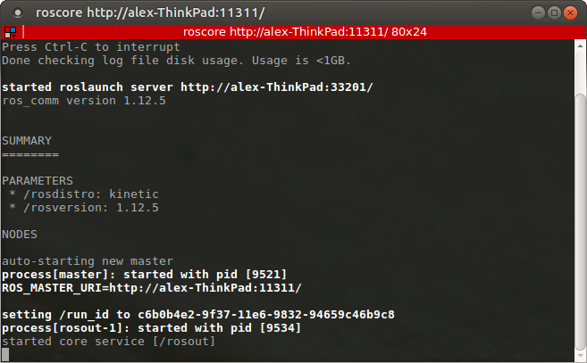
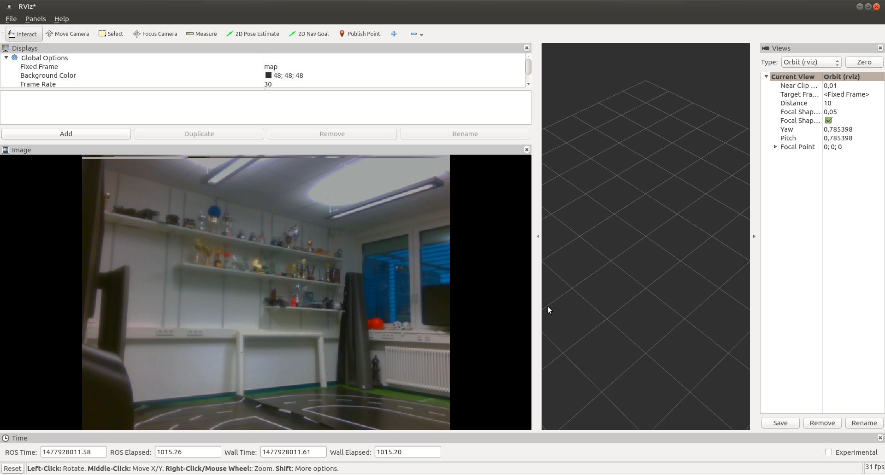

# Robotics WS 16/17
__Groupname TBA__
|__Name__                    | MatrikelNr.   | Mail  |
|----------------------------|---|---|
| Larissa Zech               | tba   | tba  |
|  Niels Groth               | tba | tba  |
|   Alexander Hinze-Hüttl    | 4578322   | hinze.alex@gmail.com   |

## 1. Installation:


## 2. Finding a group and time slot for robot time
* Monday 4pm
* Larissa Zech
* Niels Groth
* Alexander Hinze-Hüttl
## 3. Data recording from the robot model car

```bash
alex@alex-ThinkPad ~ $ rostopic list
/SR300_nodelet_manager/bond
/app/camera/rgb/image_raw
/app/camera/rgb/image_raw/compressed
/app/camera/rgb/image_raw/compressed/parameter_descriptions
/app/camera/rgb/image_raw/compressed/parameter_updates
/app/camera/rgb/image_raw/compressedDepth
/app/camera/rgb/image_raw/compressedDepth/parameter_descriptions
/app/camera/rgb/image_raw/compressedDepth/parameter_updates
/app/camera/rgb/image_raw/theora
/app/camera/rgb/image_raw/theora/parameter_descriptions
/app/camera/rgb/image_raw/theora/parameter_updates
/camera_nodelet/parameter_descriptions
/camera_nodelet/parameter_updates
/clicked_point
/depth/camera_info
/depth/image_raw
/depth/image_raw/compressed
/depth/image_raw/compressed/parameter_descriptions
/depth/image_raw/compressed/parameter_updates
/depth/image_raw/compressedDepth
/depth/image_raw/compressedDepth/parameter_descriptions
/depth/image_raw/compressedDepth/parameter_updates
/depth/image_raw/theora
/depth/image_raw/theora/parameter_descriptions
/depth/image_raw/theora/parameter_updates
/depth/points
/initialpose
/ir/camera_info
/ir/image_raw
/ir/image_raw/compressed
/ir/image_raw/compressed/parameter_descriptions
/ir/image_raw/compressed/parameter_updates
/ir/image_raw/compressedDepth
/ir/image_raw/compressedDepth/parameter_descriptions
/ir/image_raw/compressedDepth/parameter_updates
/ir/image_raw/theora
/ir/image_raw/theora/parameter_descriptions
/ir/image_raw/theora/parameter_updates
/manual_control/lights
/manual_control/speed
/manual_control/steering
/manual_control/stop_start
/motor_control/twist
/move_base_simple/goal
/rgb/camera_info
/rosout
/rosout_agg
/rviz_1477923174219410301/compressed/parameter_descriptions
/rviz_1477923174219410301/compressed/parameter_updates
/rviz_1477925973376252895/compressed/parameter_descriptions
/rviz_1477925973376252895/compressed/parameter_updates
/scan
/tf
/tf_static
```

