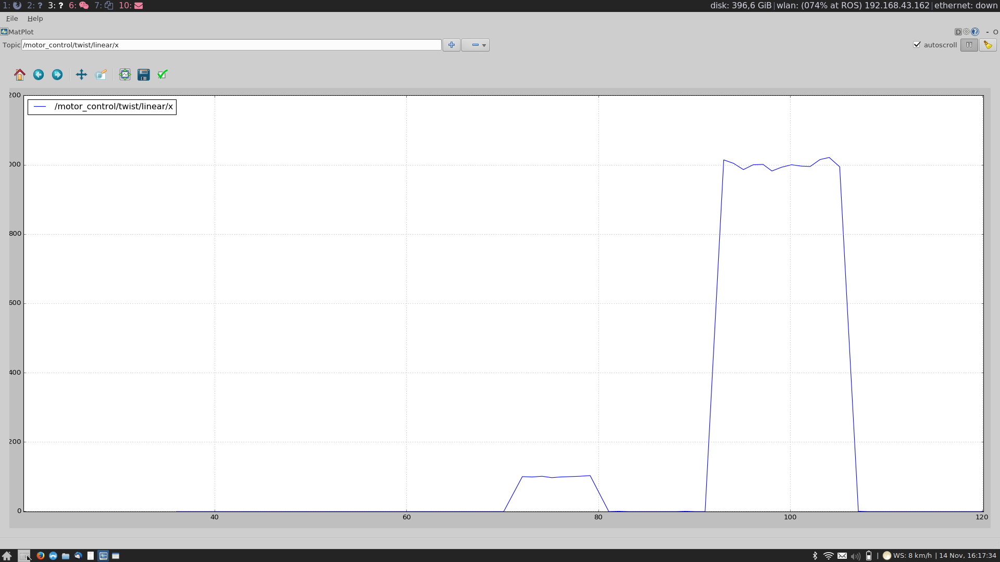
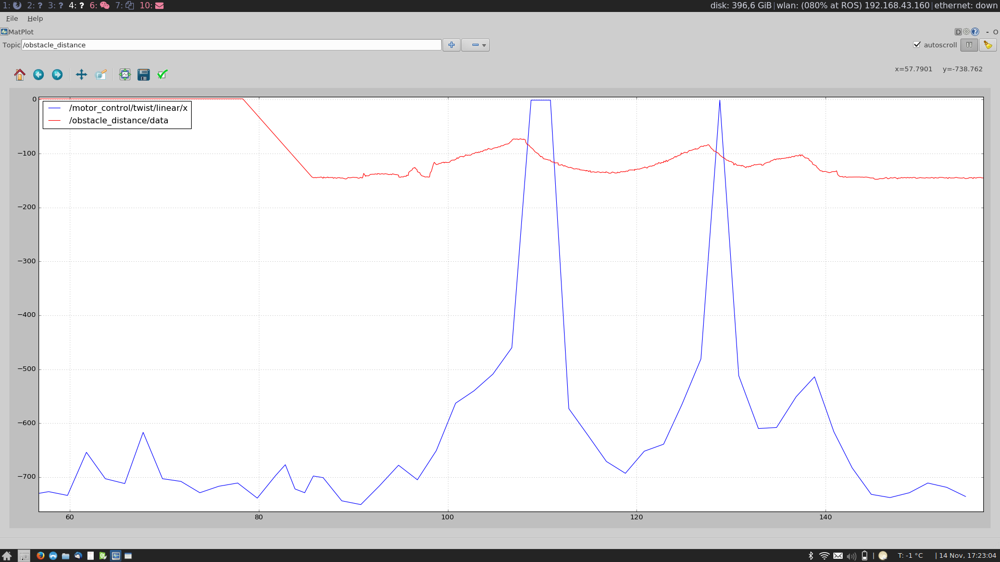

# Robotics WS 16/17 - Group _Pingu_ 🐧

__Assignment: 2__

|  Name                      | MatrikelNr.   | Mail                       |
|----------------------------|---------------|----------------------------|
| Larissa Zech               | 4594149       | larissa.zech@fu-berlin.de  |
| Niels Groth                | 4573930       | niels.groth@fu-berlin.de   |
| Alexander Hinze-Hüttl      | 4578322       | hinze.alex@gmail.com       |

## 1. Coordinate Transformation
### a)

__rotation and translation matrices:__

$
T_1 = \begin{pmatrix}
  1 & 0 & L_1\\
  0 & 1 & 0\\
  0 & 0 & 1
\end{pmatrix}
$

$ R_1 =
 \begin{pmatrix}
  \cos -\theta_1 & -\sin -\theta_1 & 0\\
  \sin -\theta_1 & \cos -\theta_1 & 0\\
  0 & 0 & 1
\end{pmatrix}
$

$
R_2 = \begin{pmatrix}
 \cos \theta_2 & -\sin \theta_2 & 0\\
 \sin \theta_2 & \cos \theta_2 & 0\\
 0 & 0 & 1
\end{pmatrix}
$

$ T_2 = \begin{pmatrix}
  1 & 0 & L_2\\
  0 & 1 & 0\\
  0 & 0 & 1
\end{pmatrix}
$

__Calculate $x_1,y_1,x_2,y_2$:__

* $(x_1,y_1,w_1)^T = R_1 * T_1 * (x,y,1)^T$
$(x_2,y_2,w_2)^T = R_2 * T_2 (x_1,y_1,w_1)^T$

* $x_1 = x * \cos(-\theta_1) - y * \sin(-\theta_1) + L_1*1$
$y_1 = x * \sin(-\theta_1) + y * \cos(-\theta_1)$

* $x_2 = x_1 * \cos(-\theta_2) - y_1 * \sin(-\theta_2) + L_2$
$y_2 = x_1 * \sin(-\theta_2) + y_1 * \cos(-\theta_2)$

Lösung Niels:
* $x_1 = L_1 \cdot cos(\theta_1)$
* $y_1 = -L_1 \cdot sin(\theta_1)$
* $x_2 = L_2 \cdot cos(\theta_2) + x_1$
* $y_2 = -L_2 \cdot sin(\theta_2) + y1$

[ [cos (-40) , -sin(-40) , 0 ] , [ sin(-40) , cos(-40) , 0 ] , [0,0,1] ]  * {10,0,0}

### b)
__Partial derivative respect to $\theta_1$__
where $\theta_2,x,y$ are constants:
* $x_1'(\theta_1) = -x*\sin(-\theta_1) - y*\cos(-\theta_1)$
$y_1'(\theta_1) = x*\cos(-\theta_1) - y*\sin(-\theta_1)$

* $x_2'(\theta_1) = x_1'(\theta_1) * \cos(-\theta_2) - y_1'(\theta_1) * \sin(-\theta_2)$
$y_2'(\theta_1) = x_1'(\theta_1) * \sin(-\theta_2) + y_1'(\theta_1)* \cos(-\theta_2)$

__Partial derivative respect to $\theta_2$:__
where $\theta_1,x_1,y_1$ are constants:
* $x_2'(\theta_1) = - x_1 * \sin(-\theta_2) - y_1 * \cos(-\theta_2)$
$y_2' = x_1 * \cos(-\theta_2) - y_1 * \sin(-\theta_2)$

Lösung Niels:
* $x_2 = L_2 \cdot cos(\theta_2) + L_1 \cdot  cos(\theta_1)$
* $y_2 = -L_1 \cdot sin(\theta_2) - L_1 \cdot sin(\theta_1)$

__Partial derivative for $x_2$:__
* $\frac{\delta x_2}{\delta \theta_1} = -L_1 \cdot sin(\theta_1)$
* $\frac{\delta x_2}{\delta \theta_2} = -L_2 \cdot sin(\theta_2)$
* $\frac{\delta x_2}{\delta L_1} = -sin(\theta_1)$
* $\frac{\delta x_2}{\delta L_2} = -sin(\theta_2)$

__Partial derivatives for $y_2$:__
* $\frac{\delta y_2}{\delta \theta_1} = -L_1 \cdot cos(\theta_1)$
* $\frac{\delta y_2}{\delta \theta_2} = -L_2 \cdot cos(\theta_2)$
* $\frac{\delta y_2}{\delta L_1} = -sin(\theta_1)$
* $\frac{\delta y_2}{\delta L_2} = -sin(\theta_2)$

## 2. Rotation Matrix as an Operator
### a)
3D-Rotation matrix has $3\times3$ values. The matrix is defined by three angles _pitch,yaw_ and _roll_. Each value $r_{xy}$ is defined by these angles combined with trigonomic functions:

* You can simply choose three random angles to calculate $R$.

Let $(\alpha = 10^\circ, \beta = 306^\circ, \gamma = 164^\circ)$ be three random angles.

Here is the Matrix:
$$
R= \begin{pmatrix}
0.579 & -0.053 & 0.814 \\
0.102 & -0.985 & -0.136\\
0.809 & 0.162 & -0.565
\end{pmatrix}
$$

### b)
Homogeneous transformation matrix. See the rotation part in the left top corner
extendet by the translation part in the last column:
$$
M = \begin{pmatrix}
0.579 & -0.053 & 0.814 & 3 \\
0.102 & -0.985 & -0.136 & 2\\
0.809 & 0.162 & -0.565 & 5\\
0 & 0 & 0 & 1
\end{pmatrix}
$$

### c)
First make $(1,2,3)^T \rightarrow (1,2,3,1)^T$ then calc $M * (1,2,3,1)^T$:

$
x = 0.579 * 1 -0.053 * 2 + 0.814 * 3 + 3 * 1 = 5.915
$

$
y = 0.102 * 1 -0.985 * 2  -0.136 * 3 + 2 * 1 = -0.276
$

$
z = 0.809 * 1 + 0.162 * 2 -0.565 * 3 + 5 * 1 = 4,438
$

$
w = 0 * 1 + 0 * 2 + 0 * 3 + 1*1 = 1
$

## 3. Working with the Car
### a)
We hade some problems while publishing the new speed. Thats why we set the speed to `1000` instead of `500`:

### b)
To move the card foreward, we need to publish a negative speed. Thats why the plot of the speed is negative.

