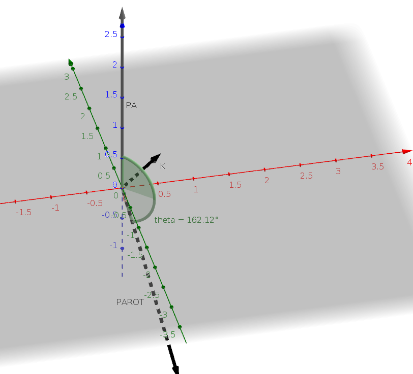

# Robotics WS 16/17 - Group _Pingu_ 🐧

__Assignment: 3__

|  Name                      | MatrikelNr.   | Mail                       |
|----------------------------|---------------|----------------------------|
| Alexander Hinze-Hüttl      | 4578322       | hinze.alex@gmail.com       |
| Sinur Sama                 |  TBA          |          TBA               |

## 1. Representations

### a)
Given $r$, $\theta$ and $h$. The cartesian coordinates (x,y,z) can then be defined as:\\
$$
cos(\theta)=\frac{x}{r} \Leftrightarrow x=cos(\theta)
$$
$$
sin(\theta)=\frac{y}{r} \Leftrightarrow y=sin(\theta)
$$
$$
z=h
$$
First, $z=2$ is the height above the xy plane. The angle can be calculated by
$\theta = atan2(1,3 ) = 18.42^\circ$, where:
 

At least, we need $r$, which is defined as $|(3,1,0)^T| = \sqrt{3^2 + 1} = \sqrt{10} = 3.16$.
$$
P_A = (\theta = 18.42^\circ , r = 3.16 , z=2)
$$
Here is a plot:


### b)
Given $r$, $\alpha$ and $\beta$. The cartesian coordinates (x,y,z) can then be defined as:
$$
x=r\sin(\alpha)\cos(\beta)
$$
$$
y=r\sin(\alpha)\sin(\beta)
$$
$$
z=r\cos(\alpha)
$$

The length of the vector can be calculated by $r = \sqrt{3^2 + 1^2 + 2^2} = 3.74$
The angle on xy plane is defined by $\alpha = atan2(1,3) = 18.42^\circ$.
$\beta$ is defined as angle between the vector and the z-axis: $\cos^{-1}(\frac{2}{r}) = 57.7^\circ$
So we got $$P_B = (r=3.74, \alpha = 18.42^\circ, \beta = 57.7^\circ) $$
Here is a plot:


## Transformations
### a)
Lets build the rotations matrices:

$R_z(\alpha) = \begin{pmatrix}
 \cos(\alpha) & -\sin(\alpha)&, 0\\
 \sin(\alpha) & \cos(\alpha) & 0\\
 0 & 0 & 1
\end{pmatrix}$

$
R_y(\beta) = I
$

$
R_x(\gamma) = \begin{pmatrix}
1 & 0 & 0\\
0 & \cos(\gamma)& -\sin(\gamma)\\
0 & sin(\gamma)& \cos(\gamma)\\
\end{pmatrix}
$

Multiply them:
$
R_B^A = R_z  R_y R_x = \begin{pmatrix}
\cos(\alpha) & -sin(\alpha)\cos(\gamma) & \sin(\alpha) \sin(\gamma)\\
\sin(\alpha) & \cos(\alpha) \cos(\gamma) & -\sin(\gamma) \cos(\alpha)\\
0 & \sin(\gamma) & \cos(\gamma)
\end{pmatrix}
$

### b)
Use simple matrix multiplication here:
$P^A = R_B^A * P^B
$


## Rotations
### a)
Get angle from length of vector:
$\theta = |\Theta| = \sqrt{8} = 162.1^\circ$

Norm vector to get unit vector:
$k = \frac{\Theta}{|\Theta|} = \frac{1}{\sqrt{8}} (2,2,0)^T = (0.71,0.71,0)^T$


### b)

$K = \begin{pmatrix}
0 & -k_3 & k_2\\
k_3 & 0 & -k_1\\
-k_2 & k_1 & 0
\end{pmatrix} =  \frac{1}{\sqrt{8}} \begin{pmatrix}
0 & 0 & 2\\
0 & 0 & -2\\
-2 & 2 & 0
\end{pmatrix} = \begin{pmatrix}
0 & 0 & \frac{1}{\sqrt{2}} \\
0 & 0 & -\frac{1}{\sqrt{2}} \\
-\frac{1}{\sqrt {2}}  & \frac{1}{\sqrt{2}} & 0
\end{pmatrix}
$


$
K^2 = \begin{pmatrix}
-0.5 & 0.5 & 0\\
0.5 & -0.5 & 0\\
0 &  0 & -1
\end{pmatrix}
$
$\sin(\theta) = 0.31$
$1-\cos(\theta) = 1.95$
Calculate rotation matrix:

$
R = I + \sin(\theta) * K + (1-\cos(\theta)) * K^2
$

$
R = \begin{pmatrix} 1 & 0 & 0\\ 0 & 1 & 0\\ 0 & 0 & 1\end{pmatrix} +
\begin{pmatrix} 0 & 0 & 0.22\\ 0 & 0 & -0.22\\ -0.22 & 0.2 & 0 \end{pmatrix} +
\begin{pmatrix} -0.98 & 0.98 & 0\\ 0.98 & -0.98 & 0\\ 0 & 0 & -1.95\end{pmatrix}
= \begin{pmatrix} 0.02 & 0.98 & 0.22 \\ 0.98 & 0.2 & -0.22\\ -0.22 & 0.22 & -0.95 \end{pmatrix}
$


Now let python check, if our matrix is orthogonal ($RR^T = I$). Lets round up
to
```python
>>> np.around(np.dot(R,np.transpose(R)))
array([[ 1.,  0.,  0.],
       [ 0.,  1.,  0.],
       [ 0.,  0.,  1.]])
```

### c)


### d)
$k*p_A = \vec{0}$

$K * P_A = (2.12,-2.12,0)^T$

$
P_{A_{ROT}} = P_A * \cos(\theta) + K*P_A  * \sin(\theta) + k(k*P_A)(1-\cos(\theta))
$
$
= (0,0,-2.85)^T + (0.65,-0.65,0)^T + 0
$
$
= (0.65,-0.65,-2.85)^T
$

Here is a plot:

### e)
