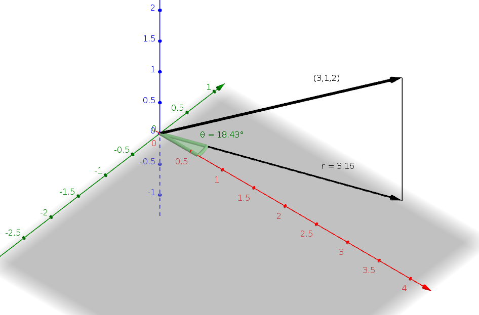

# Robotics WS 16/17 - Group _Pingu_ 🐧

__Assignment: 3__

|  Name                      | MatrikelNr.   | Mail                       |
|----------------------------|---------------|----------------------------|
| Alexander Hinze-Hüttl      | 4578322       | hinze.alex@gmail.com       |
| Sinur Sama                 |  TBA          |          TBA               |

## 1. Representations

### a)
Given $r$, $\theta$ and $h$. The cartesian coordinates (x,y,z) can then be defined as:\\
$$
cos(\theta)=\frac{x}{r} \Leftrightarrow x=cos(\theta)
$$
$$
sin(\theta)=\frac{y}{r} \Leftrightarrow y=sin(\theta)
$$
$$
z=h
$$
First, $z=2$ is the height above the xy plane. The angle can be calculated by
$\theta = atan2(1,3 ) = 18.42^\circ$, where:
 

At least, we need $r$, which is defined as $|(3,1,0)^T| = \sqrt{3^2 + 1} = \sqrt{10} = 3.16$.
$$
P_A = (\theta = 18.42^\circ , r = 3.16 , z=2)
$$
Here is a plot:

### b)
Given $r$, $\alpha$ and $\beta$. The cartesian coordinates (x,y,z) can then be defined as:
$$
x=r\sin(\alpha)\cos(\beta)
$$
$$
y=r\sin(\alpha)\sin(\beta)
$$
$$
z=r\cos(\alpha)
$$

The length of the vector can be calculated by $r = \sqrt{3^2 + 1^2 + 2^2} = 3.74$
The angle on xy plane is defined by $\alpha = atan2(1,3) = 18.42^\circ$.
$\beta$ is defined as angle between the vector and the z-axis: $\cos^{-1}(\frac{2}{r}) = 57.7^\circ$
So we got $$P_B = (r=3.74, \alpha = 18.42^\circ, \beta = 57.7^\circ) $$
Here is a plot:

## Transformations

## Rotations
### a)
Get angle from length of vector:
$\theta = |\Theta| = \sqrt{8} = 162.1^\circ$

Norm vector to get unit vector:
$k = \frac{\Theta}{|\Theta|} = \frac{1}{\sqrt{8}} (2,2,0)^T = (0.71,0.71,0)^T$

### b)

$K = \begin{pmatrix}
0 & -k_3 & k_2\\
k_3 & 0 & -k_1\\
-k_2 & k_1 & 0
\end{pmatrix} =  \frac{1}{\sqrt{8}} \begin{pmatrix}
0 & 0 & 2\\
0 & 0 & -2\\
-2 & 2 & 0
\end{pmatrix}
$
Now convert to Euler parameters:
$
\epsilon_0 = \cos \frac{\theta}{2} =  0.156
$

$
\epsilon_1 = k_x \sin \frac{\theta}{2} = 1.976
$

$
\epsilon_2 = k_y \sin \frac{\theta}{2} =  1.976
$

$
\epsilon_2 = k_z \sin \frac{\theta}{2} =  0
$

Now calculated the rotation matrix:
$$
R={\begin{pmatrix}\cos \theta +k_{x}^{2}\left(1-\cos \theta \right)&k_{x}k_{y}\left(1-\cos \theta \right)-k_{z}\sin \theta &k_{x}k_{z}\left(1-\cos \theta \right)+k_{y}\sin \theta \\k_{y}k_{x}\left(1-\cos \theta \right)+k_{z}\sin \theta &\cos \theta +k_{y}^{2}\left(1-\cos \theta \right)&k_{y}k_{z}\left(1-\cos \theta \right)-k_{x}\sin \theta \\k_{z}k_{x}\left(1-\cos \theta \right)-k_{y}\sin \theta &k_{z}k_{y}\left(1-\cos \theta \right)+k_{x}\sin \theta &\cos \theta +k_{z}^{2}\left(1-\cos \theta \right)\end{pmatrix}}
$$

$$
R={\begin{pmatrix}
6.85      &   7.804   &    0.61 \\
7.804     &   6.85         &   -0.61 \\
-0.61     &   0.61        & -0.951
\end{pmatrix}}
$$

Calculate rotation matrix:

$
R = I + \sin(\theta) * K + (1-\cos(\theta)) * K^2
$

$ =  \begin{pmatrix} 1 & 0 & 0\\ 0 & 1 & 0\\ 0 & 0 & 1 \end{pmatrix}  + 0.11* \begin{pmatrix}
 0 & 0 & 2\\
 0 & 0 & -2\\
 -2 & 2 & 0
 \end{pmatrix} + 1.95 *  \begin{pmatrix}
 0 & 0 & 32\\
 0 & 0 & 32\\
 32 & 32 & 0
 \end{pmatrix}
$

$
= \begin{pmatrix}
1 & 0 & 62.62\\
0 & 1 & 62.18\\
62.18 & 62.62 & 1
\end{pmatrix}
$

### c)

### d)
