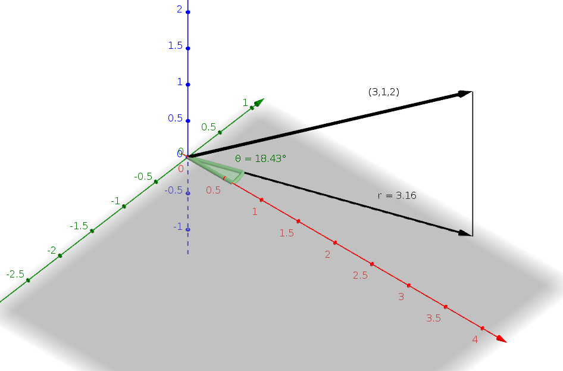
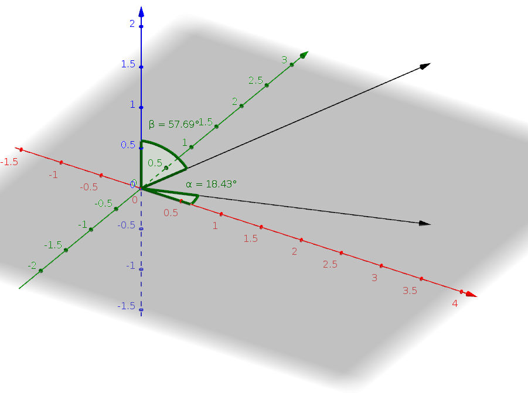

# Robotics WS 16/17 - Group _Pingu_ 🐧

__Assignment: 3__

|  Name                      | MatrikelNr.   | Mail                       |
|----------------------------|---------------|----------------------------|
| Larissa Zech               | 4594149       | larissa.zech@fu-berlin.de  |
| Niels Groth                | 4573930       | niels.groth@fu-berlin.de   |
| Alexander Hinze-Hüttl      | 4578322       | hinze.alex@gmail.com       |

## 1. Representations

### a)
Given $r$, $\theta$ and $h$. The cartesian coordinates (x,y,z) can then be defined as:\\
$$
cos(\theta)=\frac{x}{r} \Leftrightarrow x=cos(\theta)\circr\\
sin(\theta)=\frac{y}{r} \Leftrightarrow y=sin(\theta)\circr\\
z=h\\
$$
First, $z=2$ is the height above the xy plane. The angle can be calculated by
$\theta = atan2(1,3 ) = 18.42^\circ$, where:
 

At least, we need $r$, which is defined as $|(3,1,0)^T| = \sqrt{3^2 + 1} = \sqrt{10} = 3.16$.
$$
P_A = (\theta = 18.42^\circ , r = 3.16 , z=2)
$$
Here is a plot:

### b)
Given $r$, $\alpha$ and $\beta$. The cartesian coordinates (x,y,z) can then be defined as:
$$
x=r\circsin(\alpha)\circcos(\beta)
y=r\circsin(\alpha)\circsin(\beta)
z=r\circcos(\alpha)
$$

The length of the vector can be calculated by $r = \sqrt{3^2 + 1^2 + 2^2} = 3.74$
The angle on xy plane is defined by $\alpha = atan2(1,3) = 18.42^\circ$.
$\beta$ is defined as angle between the vector and the z-axis: $\cos^{-1}(\frac{2}{r}) = 57.7^\circ$
So we got $$P_B = (r=3.74, \alpha = 18.42^\circ, \beta = 57.7^\circ) $$
Here is a plot:

## Transformations

## Rotations
### a)

### b)

### c)

### d)
